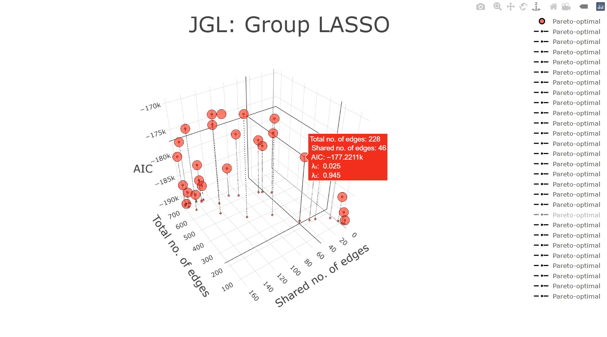
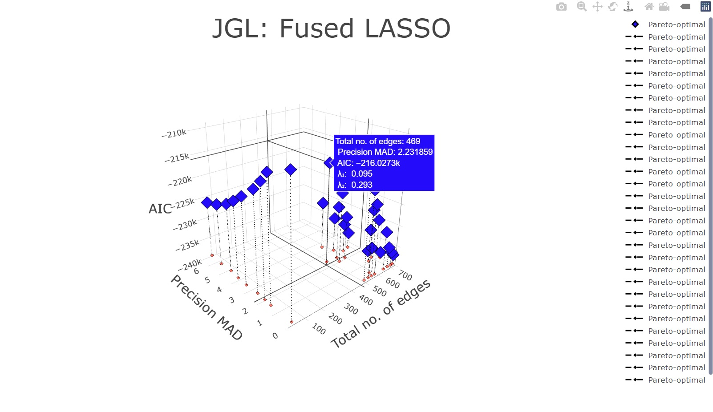
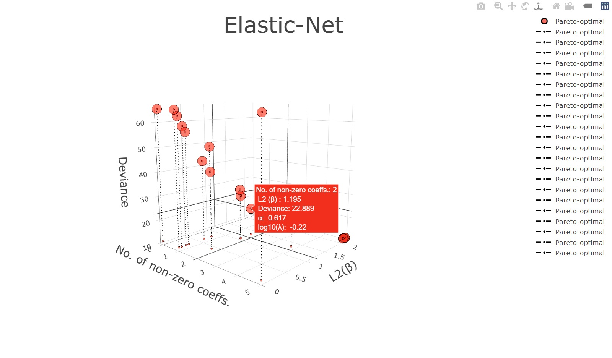
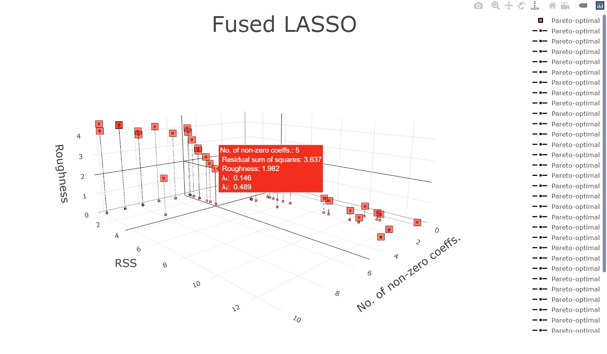
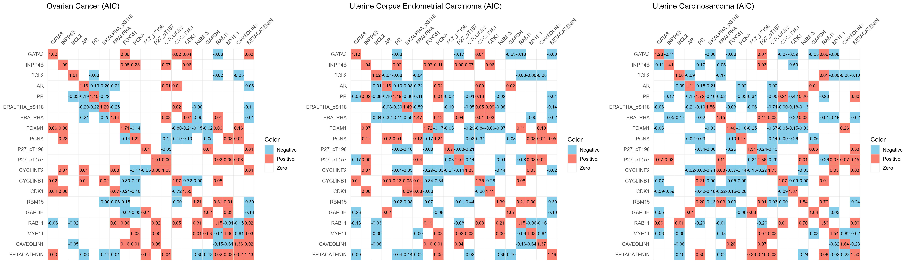
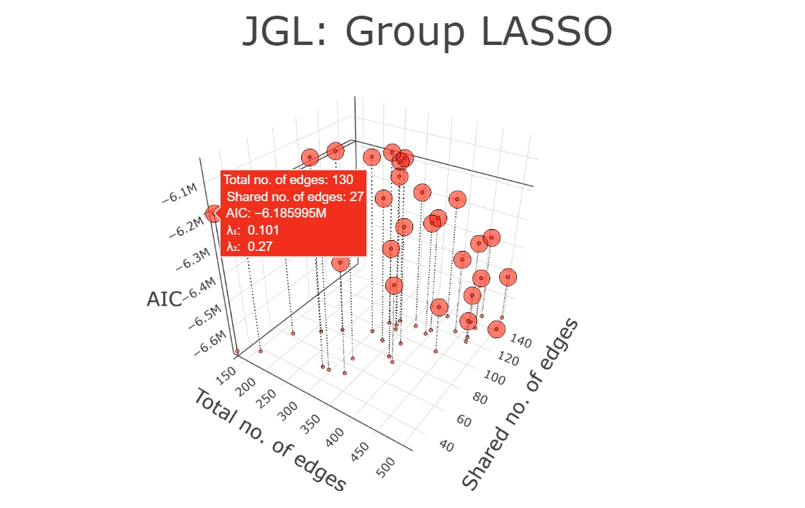
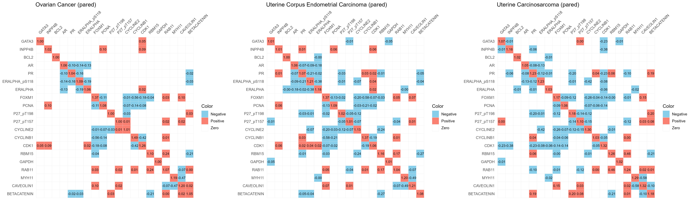

# `pared`: Model selection using multi-objective optimization
We present the R package `pared` to enable the use of multi-objective optimization for model selection. Our approach entails the use of Gaussian process-based optimization to efficiently identify solutions that represent desirable trade-offs. Our implementation includes popular models with multiple objectives including the elastic
net, fused lasso, fused graphical lasso, and group graphical lasso. Provided R package `pared` generate interactive graphics that allow the user to identify hyperparameter values that result in fitted models which lie on the Pareto frontier.


## Table of Contents
- [Installation](#installation)
- [Joint Graphical LASSO](#joint-graphical-lasso)
- [Elastic-Net](#elastic-net)
- [Fused LASSO](#fused-lasso)
- [Case-study: Fitting JGL to cancer proteomics dataset](#case-study-fitting-jgl-to-cancer-proteomics-dataset)

## Installation
R package `pared` can be directly installed from GitHub as follows.
```r
# Install packages
devtools::install_github("priyamdas2/pared", force = TRUE)
# load library
library(pared)
```
## Joint Graphical LASSO
The function `pared_JGL()` generates an interactive 3D Pareto front plot for the Joint Graphical Lasso (JGL) using GP-based optimization. It supports both group and fused penalties. Additionally, it provides the list of Pareto-optimal values of the tuning parameters λ₁ and λ₂.
```r
# See help for pared_JGL
?pared_JGL
```
### JGL with group penalty
Following example code identifies the Pareto-optimal points for Group JGL. 

```r
# Generate sample
sample_data <- generate_sample(sample_sizes = c(30, 50, 40, 70), rand_seed = 123)
# Finding optimals on Pareto-frontier for 'group' JGL
result <- pared_JGL(sample_list = sample_data, method = "group", Pareto_budget = 50)
# Extract list of optimal tuning parameters
result$summary_table
# Extract interactive figure showing optimal points on Pareto-frontier
result$figure
```
A screenshot of the generated interactive plotly plot is provided below.



Fitting back JGL with group penalty for any given values of λ₁ (= 0.025) and λ₂ (= 0.945).

```r
# Install JGL package from github (if the github installation doesn't work,
# see aformentioned instructions on loading functions in JGL package without installation)

devtools::install_github("patrickjdanaher/JGL-package", force = TRUE)
library(JGL)

lambda.opt.pared <- c(0.025, 0.945) 
JGL.result.pared <- JGL(sample_data, penalty="group", lambda1 = lambda.opt.pared[1], lambda2=lambda.opt.pared[2])
Precision.estimated.array <- JGL.result.pared$theta

# Print precision matrices 1, 2, 3 and 4
print(Precision.estimated.array[[1]])
print(Precision.estimated.array[[2]])
print(Precision.estimated.array[[3]])
print(Precision.estimated.array[[4]])
```

### JGL with fused penalty
Following example code identifies the Pareto-optimal points for Fused JGL.

```r
sample_data2 <- generate_sample()
resultFused <- pared_JGL(sample_list = sample_data2, method = "fused", 
                         plot_marker_symbol = 'diamond', plot_marker_color = 'blue', 
                         plot_marker_size = 7, Pareto_budget = 40)

resultFused$summary_table
resultFused$figure
```
A screenshot of the generated interactive plotly plot is provided below.



## Elastic-Net

The function `pared_ENet()` performs a Pareto optimality search on the Elastic-Net problem using GP-based optimization and creates a 3D scatter plot of the solution space. The plot displays the number of non-zero coefficients, L2 norm of coefficients, and deviance for different Pareto-optimal combinations of the regularization parameters 𝛼 (0 < 𝛼 < 1) and λ.

```r
# See help for pared_ENet
?pared_ENet

set.seed(1)
p <- 5
X <- matrix(rnorm(100), ncol = p)
n <- dim(X)[1]
beta.true <- matrix(c(1,2), ncol = 1)  # only first few coordinates are non-zero
y <- X[, 1:2] %*% beta.true + rnorm(n)

A <- pared_ENet(X, y, Pareto_budget = 50)
A$summary_table
A$fig
```
A screenshot of the generated interactive plotly plot is provided below.


Fitting back Elastic Net for any given values of 𝛼 (= 0.617) and λ (= 10 ^ (- 0.22)).

```r
# Fitting elastic net with desired alpha and lambda values

library(glmnet)
ElasticNet.fit <- glmnet(X, y, alpha = 0.617, lambda = 10 ^ (- 0.22))
print(ElasticNet.fit$beta)
```


## Fused LASSO

The function `pared_FLasso()` performs a Pareto optimality search on the Fused Lasso problem using GP-based optimization and creates a 3D scatter plot of the solution space. The plot displays the number of non-zero coefficients, residual sum of squares (RSS), and roughness (mean absolute difference of consecutive beta coefficients) for different Pareto-optimal combinations of the regularization parameters λ₁ and λ₂.

```r
# See help for pared_FLasso
?pared_FLasso


set.seed(123)
n <- 100
p <- 10
X <- matrix(rnorm(n * p), nrow = n, ncol = p)
beta_true <- c(0, 0, 1, 1, 1, 0, 0, 0, 2, 2)
y <- X %*% beta_true + rnorm(n)


result <- pared_FLasso(X, y, Pareto_budget = 80, plot_marker_symbol = 'square', plot_marker_size = 7)
result$summary_table
result$figure
```

A screenshot of the generated interactive plotly plot is provided below.


Fitting back Fused Lasso for any given values of λ₁ (= 0.146) and λ₂ (= 0.002).

```r
# Fitting fused lasso with desired lambda_1 and lambda_2 values

log_lam1 <- log10(0.146)
log_lam2 <- log10(0.002)

g <- function(beta) FLasso_objective(X, y, beta, log_lam1, log_lam2)

beta_init <- rep(0, p)
opt_result <- optim(par = beta_init, fn = g,  method = "BFGS", control = list(maxit = 1000))
beta_opt <- opt_result$par
print(beta_opt)
```

## Case-study: Fitting JGL to cancer proteomics dataset

We consider The Cancer Genome Atlas (TCGA) proteomic data for three related cancers: Ovarian Cancer (OV), Uterine Corpus Endometrial Carcinoma (UCEC), and Uterine Carcinosarcoma (UCS), with sample sizes of 428, 404, and 48, respectively. In total, we consider 20 proteins that collectively represent the *breast reactive*, *cell cycle*, *hormone receptor*, and *hormone signaling breast* pathways. We first apply the Joint Graphical Lasso (JGL) with a group penalty, varying λ₁ and λ₂, and select the model with the lowest AIC. The estimated precision matrices for the three cancers are shown below.

- First we extract proteomic data corresponding to the *breast reactive*, *cell cycle*, *hormone receptor*, and *hormone signaling breast pathways* for Ovarian Cancer (OV), Uterine Corpus Endometrial Carcinoma (UCEC), and Uterine Carcinosarcoma (UCS).

<details>
<summary><strong>📌 <span style="color: #0366d6;">Show R code</span></strong></summary>

  
```r
# List of cancers to work with: OV, UCEC, UCS
rm(list=ls())
# devtools::install_github("priyamdas2/pared", force = TRUE)
library(pared)
library(ggplot2)
library(reshape2)
library(magick)
library(igraph)

################################################################################
### Sourcing JGL functions #####################################################
################################################################################
source("JGL supp funs/admm.iters.R")
source("JGL supp funs/admm.iters.unconnected.R")
source("JGL supp funs/crit.R")
source("JGL supp funs/dsgl.R")
source("JGL supp funs/flsa.general.R")
source("JGL supp funs/flsa2.R")
source("JGL supp funs/gcrit.R")
source("JGL supp funs/JGL.R")
source("JGL supp funs/make.adj.matrix.R")
source("JGL supp funs/net.degree.R")
source("JGL supp funs/net.edges.R")
source("JGL supp funs/net.hubs.R")
source("JGL supp funs/net.neighbors.R")
source("JGL supp funs/penalty.as.matrix.R")
source("JGL supp funs/screen.fgl.R")
source("JGL supp funs/screen.ggl.R")
source("JGL supp funs/soft.R")
source("JGL supp funs/subnetworks.R")

################################################################################
### Reading dataset ############################################################
################################################################################

names_vector <- read.csv("NExUS data/cancer_serial_no.csv", header = FALSE)[[1]]
target_terms <- c("OV", "UCEC", "UCS")
match_indices <- which(names_vector %in% target_terms)
matched_names <- names_vector[match_indices]
matrix_list <- lapply(match_indices, function(i) {
  file_path <- file.path("NExUS data", paste0(i, ".csv"))
  as.matrix(read.csv(file_path, header = FALSE))
})
names(matrix_list) <- matched_names


OV <- matrix_list$OV
UCEC <- matrix_list$UCEC
UCS <- matrix_list$UCS

################################################################################
### Selecting variables ########################################################
################################################################################

### Full pathway information ###################################################
# load("U:/MOOP_Christine/Github_vignette/Case study/NExUS data/RPPA_12_pathway.rda")
name_list <- vector("list", 12)
array_names_FULL <- c("APOPTOSIS", "CELL CYCLE", "DNA DMG RSPNS", "EMT", 
                      "HORMONE RECPTR", "HORMONE SIG BRST", "PI3K/AKT",
                      "RAS/MAPK", "RTK", "TSC/mTOR", "BREAST REACTIVE", 
                      "CORE REACTIVE") 
Apoptosis <- c("BAK", "BAX", "BID", "BIM", "CASPASE7CLEAVEDD198", "BAD_pS112", 
               "BCL2", "BCLXL", "CIAP")
Cell_cycle <- c("CDK1", "CYCLINB1", "CYCLINE2", "P27_pT157", "P27_pT198", "PCNA",
                "FOXM1")
DNA_damage_response <- c("X53BP1", "ATM", "CHK1_pS345", "CHK2_pT68", "KU80", 
                         "MRE11", "P53", "RAD50", "RAD51", "XRCC1")
EMT <- c("FIBRONECTIN", "NCADHERIN", "COLLAGENVI", "CLAUDIN7", "ECADHERIN", 
         "BETACATENIN", "PAI1")
Hormone_receptor <- c("ERALPHA", "ERALPHA_pS118", "PR", "AR")
Hormone_signaling_Breast <- c("BCL2", "INPP4B", "GATA3")
PI3K_AKT <- c("P27_pT157", "P27_pT198", "INPP4B", "AKT_pS473", "AKT_pT308", 
              "GSK3ALPHABETA_pS21S9",
              "GSK3_pS9", "PRAS40_pT246", "TUBERIN_pT1462", "PTEN")
RAS_MAPK <- c("ARAF_pS299", "CJUN_pS73", "CRAF_pS338", "JNK_pT183Y185", 
              "MAPK_pT202Y204", "MEK1_pS217S221", "P38_pT180Y182", 
              "P90RSK_pT359S363", "YB1_pS102")
RTK <- c("EGFR_pY1068", "EGFR_pY1173", "HER2_pY1248", "HER3_pY1289", "SHC_pY317",
         "SRC_pY416", "SRC_pY527")
TSC_mTOR <- c("X4EBP1_pS65", "X4EBP1_pT37T46", "X4EBP1_pT70", "P70S6K_pT389", 
              "MTOR_pS2448", "S6_pS235S236", "S6_pS240S244", "RB_pS807S811")
Breast_reactive <- c("BETACATENIN", "CAVEOLIN1", "MYH11", "RAB11", "GAPDH", "RBM15")
Core_reactive <- c("CLAUDIN7", "ECADHERIN", "BETACATENIN", "CAVEOLIN1", "RBM15")
################################################################################

proteins_here <- unique(c(Breast_reactive, Cell_cycle, Hormone_receptor, Hormone_signaling_Breast))
selected_variables <- read.csv("NExUS data/selected_variables.csv", header = FALSE)[[1]]
match_indices <- match(proteins_here,selected_variables)


ALL_samples <- list()
ALL_samples[[1]] <- OV[, match_indices]
ALL_samples[[2]] <- UCEC[, match_indices]
ALL_samples[[3]] <- UCS[, match_indices]

C <- 3
p <- length(match_indices)
sample_sizes <- c(dim(OV)[1], dim(UCEC)[1], dim(UCS)[1])
```
</details>

- Following data extraction, we fit the group JGL model, select the optimal (λ₁, λ₂) based on AIC, and plot the estimated precision matrices for the three cancers.

<details>
<summary><strong>📌 <span style="color: #0366d6;">Show R code</span></strong></summary>

```r
################################################################################
### Fitting JGL ################################################################
################################################################################

library(mvtnorm)
library(psych)


sample <- ALL_samples
total_lambda_divisions <- 20
start_lambda <- 0.01
end_lambda <- 1
lambda_ones <- exp(seq(from = log(start_lambda), to = log(end_lambda), length.out= total_lambda_divisions))
lambda_twos <- exp(seq(from = log(start_lambda), to = log(end_lambda), length.out = total_lambda_divisions))
AIC_all_possible <- matrix(10 ^ 10, total_lambda_divisions, total_lambda_divisions)
for(i in 1:total_lambda_divisions) {
  for(j in 1:total_lambda_divisions) {
    JGL_result <- JGL(sample, penalty="group", lambda1 = lambda_ones[i], lambda2 = lambda_twos[j])
    Precision_estimated <- JGL_result$theta
    if(length(Precision_estimated[[1]]) == p^2) {
      num_non_zero_edges <- rep(0,C)
      AIC_sum <- 0
      for(c in 1:C){
        num_non_zero_edges[c] <- (length(which(abs(Precision_estimated[[c]])>0.0001))-20)/2
        S_mat <- t(sample[[c]]) %*% sample[[c]]
        AIC_sum <- AIC_sum + sample_sizes[c] * tr(S_mat %*% Precision_estimated[[c]]) - 
        sample_sizes[c] * log(det(Precision_estimated[[c]])) + 2 * num_non_zero_edges[c]
        }
      AIC_all_possible[i,j] <- AIC_sum
    }
  }
}

min_index <- which(AIC_all_possible == min(AIC_all_possible), arr.ind = TRUE)
lambda_opt <- c(lambda_ones[min_index[1]], lambda_twos[min_index[2]])

JGL_result_final <- JGL(ALL_samples, penalty="group", lambda1 = lambda_opt[1], lambda2=lambda_opt[2])
Precision_estimated_array <- JGL_result_final$theta

numEdge.1.JGLgroup <- (length(which(abs(Precision_estimated_array[[1]]) > 10 ^ -4)) - p) / 2  # Number of non-zeros in Prec. Mat. 1

numEdge.2.JGLgroup <- (length(which(abs(Precision_estimated_array[[2]]) > 10 ^ -4)) - p) / 2  # Number of non-zeros in Prec. Mat. 2

numEdge.3.JGLgroup <- (length(which(abs(Precision_estimated_array[[3]]) > 10 ^ -4)) - p) / 2  # Number of non-zeros in Prec. Mat. 3

numSharedEdges.JGLgroup <- sum(Reduce("&", lapply(Precision_estimated_array, function(M) abs(M) > 1e-4))[upper.tri(Precision_estimated_array[[1]])])  # Shared edges

summaryEdges.JGLgroup <- c(numEdge.1.JGLgroup, numEdge.2.JGLgroup, numEdge.3.JGLgroup, numSharedEdges.JGLgroup)


################################################################################
### PLOT: JGL group ############################################################
################################################################################

tol <- 1e-3
cancer_names <- c("Ovarian Cancer (AIC)", 
                  "Uterine Corpus Endometrial Carcinoma (AIC)",
                  "Uterine Carcinosarcoma (AIC)")

for (k in 1:3) {
  mat <- Precision_estimated_array[[k]]
  rownames(mat) <- colnames(mat) <- proteins_here
  
  mat_melt <- melt(mat)
  colnames(mat_melt) <- c("Row", "Col", "Value")
  
  # Reverse column order
  mat_melt$Col <- factor(mat_melt$Col, levels = rev(proteins_here))
  
  mat_melt$Color <- ifelse(abs(mat_melt$Value) < tol, "Zero",
                           ifelse(mat_melt$Value > 0, "Positive", "Negative"))
  
  mat_melt$Label <- ifelse(abs(mat_melt$Value) > tol,
                           sprintf("%.2f", mat_melt$Value),
                           "")
  
  plot_here <- ggplot(mat_melt, aes(x = Col, y = Row, fill = Color)) +
    geom_tile(color = "grey90") +
    geom_text(aes(label = Label), size = 3) + #, fontface = "bold") +
    scale_fill_manual(values = c("Zero" = "white", "Positive" = "salmon", "Negative" = "skyblue")) +
    scale_x_discrete(position = "top") +
    theme_minimal(base_size = 12) +
    theme(
      axis.text.x = element_text(angle = 45, hjust = 0),
      axis.title = element_blank(),
      panel.grid = element_blank()
    ) +
    ggtitle(cancer_names[k])
  
  print(plot_here)
  ggsave(filename = paste0("precision_heatmap_", k, ".jpg"), plot = plot_here,
         width = 8, height = 7, dpi = 300)
}


# Read images
img1 <- image_read("precision_heatmap_1.jpg")
img2 <- image_read("precision_heatmap_2.jpg")
img3 <- image_read("precision_heatmap_3.jpg")


combined <- image_append(c(img1, img2, img3))
print(combined)
image_write(combined, path = "precision_heatmaps_combined.jpg", format = "jpg")
```
</details> 



- Then we explore the Pareto front of solutions using the `pared_JGL` function.

```r
start_time <- proc.time()
result <- pared_JGL(sample_list = ALL_samples, method = "group", Pareto_budget = 50)
end_time <- proc.time()
CompTimeJGL <- (end_time - start_time)["elapsed"]
result$summary_table
result$figure
```



- From the set of candidate optimal solutions, we select (λ₁ = 0.101, λ₂ = 0.27) and visualize the precision matrices associated with the proteomic networks for these cancers.

<details>
<summary><strong>📌 <span style="color: #0366d6;">Show R code</span></strong></summary>

```r
lambda_opt_pared <- c(0.101, 0.27) # from observation
JGL_result_pared <- JGL(ALL_samples, penalty="group", lambda1 = lambda_opt_pared[1], lambda2=lambda_opt_pared[2])
Precision_estimated_array_pared <- JGL_result_pared$theta

numEdge.1.JGLgroup.pared <- (length(which(abs(Precision_estimated_array_pared[[1]]) > 10 ^ -4)) - p) / 2  # Number of non-zeros in Prec. Mat. 1

numEdge.2.JGLgroup.pared <-(length(which(abs(Precision_estimated_array_pared[[2]]) > 10 ^ -4)) - p) / 2  # Number of non-zeros in Prec. Mat. 2

numEdge.3.JGLgroup.pared <-(length(which(abs(Precision_estimated_array_pared[[3]]) > 10 ^ -4)) - p) / 2  # Number of non-zeros in Prec. Mat. 3

numSharedEdges.JGLgroup.pared <- sum(Reduce("&", lapply(Precision_estimated_array_pared, function(M) abs(M) > 1e-4))[upper.tri(Precision_estimated_array_pared[[1]])])  # Shared edges

summaryEdges.JGLgroup.pared <- c(numEdge.1.JGLgroup.pared, numEdge.2.JGLgroup.pared, numEdge.3.JGLgroup.pared, numSharedEdges.JGLgroup.pared)


tol <- 1e-3
cancer_names <- c("Ovarian Cancer (pared)", 
                  "Uterine Corpus Endometrial Carcinoma (pared)",
                  "Uterine Carcinosarcoma (pared)")

for (k in 1:3) {
  mat <- Precision_estimated_array_pared[[k]]
  rownames(mat) <- colnames(mat) <- proteins_here
  
  mat_melt <- melt(mat)
  colnames(mat_melt) <- c("Row", "Col", "Value")
  
  # Reverse column order
  mat_melt$Col <- factor(mat_melt$Col, levels = rev(proteins_here))
  
  mat_melt$Color <- ifelse(abs(mat_melt$Value) < tol, "Zero",
                           ifelse(mat_melt$Value > 0, "Positive", "Negative"))
  
  mat_melt$Label <- ifelse(abs(mat_melt$Value) > tol,
                           sprintf("%.2f", mat_melt$Value),
                           "")
  
  plot_here <- ggplot(mat_melt, aes(x = Col, y = Row, fill = Color)) +
    geom_tile(color = "grey90") +
    geom_text(aes(label = Label), size = 3) + #, fontface = "bold") +
    scale_fill_manual(values = c("Zero" = "white", "Positive" = "salmon", "Negative" = "skyblue")) +
    scale_x_discrete(position = "top") +
    theme_minimal(base_size = 12) +
    theme(
      axis.text.x = element_text(angle = 45, hjust = 0),
      axis.title = element_blank(),
      panel.grid = element_blank()
    ) +
    ggtitle(cancer_names[k])
  
  print(plot_here)
  ggsave(filename = paste0("precision_heatmap_pared_", k, ".jpg"), plot = plot_here,
         width = 8, height = 7, dpi = 300)
}

# Read images
img1 <- image_read("precision_heatmap_pared_1.jpg")
img2 <- image_read("precision_heatmap_pared_2.jpg")
img3 <- image_read("precision_heatmap_pared_3.jpg")


combined <- image_append(c(img1, img2, img3))
print(combined)
image_write(combined, path = "precision_heatmaps_pared_combined.jpg", format = "jpg")
```
</details>

Corresponding to (λ₁, λ₂) = (0.101, 0.27), the estimated network obtained using JGL with a group penalty is found to be sparser than that obtained using the conventional approach of minimizing AIC. Corresponding pan-cancer proteomic networks are provided below.



The following table reports the number of edges in the models selected by the AIC criterion and in our chosen model from the Pareto front generated using the `pared_JGL` function.

| Edge counts across cancer types | Group JGL–AIC | Group JGL–pared |
|---------------------------------|:-------------:|:----------------:|
| OV            |       63      |        34        |
| UCEC          |       78      |        47        |
| UCS           |       82      |        49        |
| Shared        |       32      |        27        |

The reproducible code used to obtain the analysis results of this case study section, along with other supplementary files, is provided in the `case study` folder.

