# `pared`: Pareto-based multi-objective tuning for statistical models

`pared` (Pareto-optimal Decision making in model selection) is an R package for model selection and hyperparameter tuning using multi-objective optimization. Instead of reducing model selection to a single criterion, `pared` identifies Pareto-optimal solutions that represent trade-offs among competing objectives, such as prediction error, sparsity, model complexity, coefficient magnitude, graph structure, and goodness of fit.

## 📚 Citation

> Das P, Robinson S, Peterson C (2026).  
> *pared: Model selection using multi-objective optimization*.  
> **ArXiv**: [https://arxiv.org/abs/2505.21730](https://arxiv.org/abs/2505.21730)

---

## 📁 File Overview

| Folder/File | Description |
|-------------|--------------------|
| `Simulation study/` | Simulation scripts for the Elastic Net and group graphical LASSO examples. |
| `case study/` | Case-study files used in the manuscript and vignette, including computation-time comparisons across FGL, GGL, ENet, and FLasso. |
| `pared_vignette.R` | Concise vignette code for the displayed examples, excluding the case study. |
| `images/` | Final versions of key figures used in the manuscript and README. |

---

## Table of Contents
- [Main functions](#main-functions)
- [Installation](#installation)
- [Basic Pareto Front Example](#basic-pareto-front-example)
- [General Pareto Front Example: SVM](#general-pareto-front-example-svm)
- [Joint Graphical LASSO](#joint-graphical-lasso)
- [Elastic-Net](#elastic-net)
- [Fused LASSO](#fused-lasso)
- [Case-study: Fitting JGL to cancer proteomics dataset](#case-study-fitting-jgl-to-cancer-proteomics-dataset)

---

## Main functions

The package is built around six main user-facing functions.

### `pared_optimize()`

`pared_optimize()` is the general-purpose Pareto optimization engine. Users provide a custom objective function, lower and upper bounds for the tuning/search parameters, objective names, and optimization directions. Each objective can be minimized or maximized. The function returns a `pared_result` object containing the Pareto-optimal parameter values, corresponding objective values, and a summary table.

This function can be used for any user-defined tuning problem, including models or objectives not included among the built-in wrappers.

### `pared_ENet()`

`pared_ENet()` applies Pareto-based tuning to Elastic Net regression. The tuning parameters are the Elastic Net mixing parameter `alpha` and the regularization parameter `lambda`, represented internally through `log10(lambda)`. The default objectives are:

- number of non-zero coefficients,
- L2 norm of the coefficient vector,
- deviance.

The function returns an interactive 3D Pareto-front plot, a summary table of Pareto-optimal tuning values, and the full `pared_result` object.

### `pared_FLasso()`

`pared_FLasso()` applies Pareto-based tuning to Fused LASSO regression. The tuning parameters are the LASSO penalty `lambda1` and the fusion penalty `lambda2`, both represented internally on the `log10` scale. The default objectives are:

- number of non-zero coefficients,
- residual sum of squares,
- coefficient roughness.

This wrapper is useful when one wants to balance sparsity, model fit, and smoothness of adjacent regression coefficients.

### `pared_JGL()`

`pared_JGL()` applies Pareto-based tuning to Joint Graphical LASSO models for multiple related groups. The tuning parameters are `lambda1` and `lambda2`, both represented internally on the `log10` scale. The function supports both:

- `method = "group"` for group graphical LASSO,
- `method = "fused"` for fused graphical LASSO.

For group graphical LASSO, the default objectives are total number of edges, shared edges, and AIC. For fused graphical LASSO, the default objectives are total number of edges, precision-matrix MAD, and AIC.

### `plot_pared_2d()`

`plot_pared_2d()` creates an interactive two-dimensional Plotly scatter plot from a `pared_result` object. Users select two objective columns to display on the x- and y-axes. Hover labels show the corresponding tuning-parameter values. This function is useful for visualizing pairwise projections of Pareto fronts, especially when more than two objectives are considered.

### `plot_pared_3d()`

`plot_pared_3d()` creates an interactive three-dimensional Plotly scatter plot from a `pared_result` object. Users select three objective columns to display on the x-, y-, and z-axes. Optional projection lines can be drawn from each Pareto point to the xy-plane. This function is useful for visualizing three-objective Pareto fronts or three-dimensional projections of higher-dimensional Pareto results.

---

## Installation

R package `pared` can be directly installed from GitHub as follows.

```r
# Install packages
pak::pak("priyamdas2/pared", force = TRUE)
# load library
library(pared)
```
To view the package documentation and function-level help pages, use:

```r
help(package = "pared")

?pared_ENet
?pared_FLasso
?pared_JGL
?pared_optimize
?plot_pared_2d
?plot_pared_3d
```
---

## Basic Pareto Front Example

The main function in `pared` is `pared_optimize()`. It is designed for situations where a user wants to tune one or more parameters, but the quality of a solution is measured using more than one criterion. Instead of combining all criteria into a single number, `pared_optimize()` searches for Pareto-optimal solutions, meaning solutions for which no objective can be improved without making at least one other objective worse.

To use `pared_optimize()`, the user needs to provide an objective function. This objective function should take a numeric vector of tuning/search parameters as input and return a numeric vector containing multiple objective values. Each objective can be set to either `"min"` or `"max"` depending on whether smaller or larger values are preferred.

In this toy example, we optimize a three-dimensional vector $z = (z_1,z_2,z_3)$, where each coordinate is constrained to lie between 1 and 2. Therefore, the search space is

$$1 \leq z_j \leq 2, \qquad j=1,2,3.$$

We define three objectives:

1. the arithmetic mean of $z_1,z_2,z_3$, which we want to **maximize**;
2. the harmonic mean of $z_1,z_2,z_3$, which we want to **minimize**;
3. the mean absolute deviation from 1.5, which we want to **minimize**.

Although this example is not based on a statistical model, it illustrates the required input structure for `pared_optimize()`.

```r
toy_objective <- function(z) c(Mean = mean(z),
                              Harmonic_mean = length(z) / sum(1 / z),
                              MAD_from_1.5 = mean(abs(z - 1.5)))
```

The function `toy_objective()` takes a candidate vector `z` and returns three objective values. The names inside the returned vector are optional, but they make the code easier to read. The important point is that the order of the returned objectives must match the order used in `objective_names` and `objective_directions` below.

Next, we run the Pareto optimization. The arguments `lower` and `upper` define the search region for the three components of `z`. Since `lower = c(1, 1, 1)` and `upper = c(2, 2, 2)`, the optimizer searches over vectors with all three coordinates between 1 and 2.

```r
set.seed(1)

toy_res <- pared_optimize(objective_fun = toy_objective,
                          lower = c(1, 1, 1),
                          upper = c(2, 2, 2),
                          budget = 30,
                          parameter_names = c("z1", "z2", "z3"),
                          objective_names = c("Mean", "Harmonic mean",
                                              "MAD around 1.5"),
                          objective_directions = c("max", "min", "min"),
                          verbose = FALSE)
```

Here, `budget = 30` specifies the number of objective-function evaluations used in the Gaussian-process-based Pareto search. The argument `parameter_names` labels the search parameters, while `objective_names` labels the three objectives returned by `toy_objective()`.

The argument `objective_directions` is especially important. In this example,

```r
objective_directions = c("max", "min", "min")
```

means that we want to maximize the first objective, minimize the second objective, and minimize the third objective. Thus, `pared_optimize()` can handle mixed optimization goals across objectives.

The Pareto-optimal solutions can be printed as a summary table.

```r
print(toy_res$summary_table)
```

Each row of `toy_res$summary_table` corresponds to a Pareto-optimal candidate. The table includes both the selected parameter values, `z1`, `z2`, and `z3`, and the corresponding objective values. These are the trade-off solutions identified by the optimizer.

For a pairwise view, we can plot two objectives at a time. The following plot displays the Pareto-optimal solutions found from the full three-objective optimization, but visualized only through the two selected objectives: `Mean` and `MAD around 1.5`. Thus, this is a two-dimensional projection of the Pareto front obtained using all three objectives, not necessarily the same Pareto front that would be obtained if the optimization were run using only these two objectives.

```r
plot_pared_2d(toy_res,
              x_objective = "Mean",
              y_objective = "MAD around 1.5",
              plot_title = "Toy Pareto front")
```

<p align="center">
  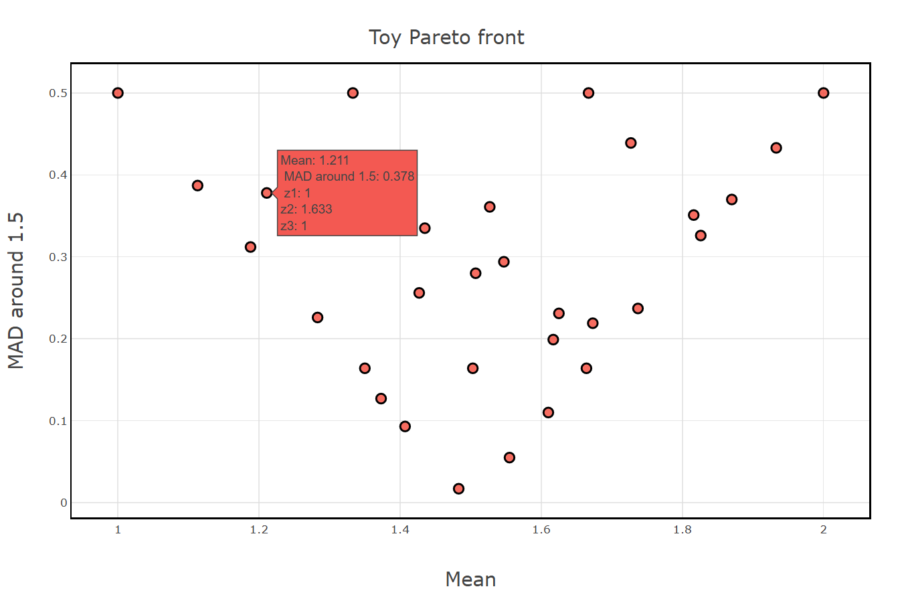
</p>


The 2D plot is useful when the user wants to inspect a specific pair of objectives. However, since the full example contains three objectives, we can also visualize all three objectives simultaneously using `plot_pared_3d()`.

```r
plot_pared_3d(toy_res,
              x_objective = "Mean",
              y_objective = "Harmonic mean",
              z_objective = "MAD around 1.5",
              plot_title = "Toy Pareto front",
              plot_marker_color = "blue")
```

<p align="center">
  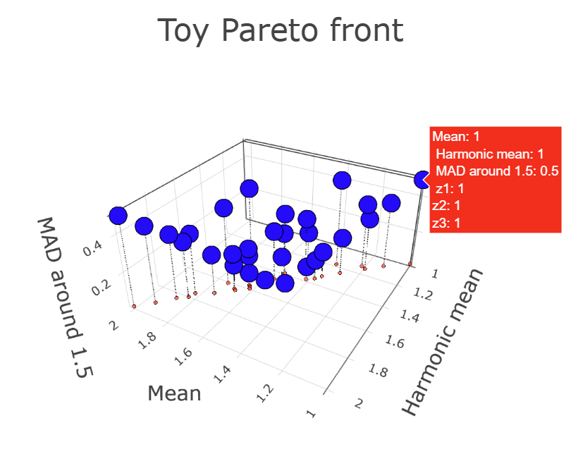
</p>

This 3D plot shows the Pareto-optimal trade-offs among all three objectives. Points on the plot correspond to candidate vectors \(z\) that lie on the Pareto front. Hovering over a point displays the corresponding parameter values, allowing the user to inspect which choices of \(z_1,z_2,z_3\) produce each trade-off.

This basic example illustrates the general workflow of `pared_optimize()`:

1. define a search space using `lower` and `upper`;
2. write an objective function that returns multiple criteria;
3. specify whether each criterion should be minimized or maximized;
4. run `pared_optimize()`;
5. inspect the Pareto-optimal solutions numerically and graphically.

---

## General Pareto Front Example: SVM

This example illustrates how `pared_optimize()` can be used with a user-defined statistical objective function. Here, we tune a radial-basis-function support vector machine (SVM) classifier on the `iris` data. The goal is not to select a single best tuning parameter by one criterion, but to identify tuning values that represent trade-offs among several model-quality measures.

For a radial SVM, we tune two parameters: the cost parameter and the kernel scale parameter. In the code below, the optimizer works on the log scale, so the search vector is $\theta = (\theta_1,\theta_2)$, where `cost = 10^theta[1]` and `gamma = 10^theta[2]`.

The package includes two convenience helper functions, `svm_objective()` and `svm_objective_constrained()`, for this README example. The function `svm_objective()` takes a candidate tuning vector `theta`, the data `X`, the class labels `y`, and cross-validation folds. It returns four objectives: cross-validated classification error, cross-validated log-loss, average support-vector fraction, and total training time. The constrained version, `svm_objective_constrained()`, uses the same objectives but penalizes candidates that exceed user-specified limits on support-vector fraction or training time.

We first prepare the data and construct stratified cross-validation folds.

```r
library(e1071)
data(iris)

X <- scale(as.matrix(iris[, 1:4]))
y <- as.factor(iris$Species)

set.seed(1)
K <- 5
fold_id <- rep(NA_integer_, length(y))
for (cl in levels(y)) fold_id[y == cl] <- sample(rep(seq_len(K), length.out = sum(y == cl)))
folds <- lapply(seq_len(K), function(k) which(fold_id == k))
```

Before running the Pareto optimization, it is useful to check that the objective function works at one candidate tuning value. The following call evaluates the SVM objective at `theta = c(0.5, -1.5)`, corresponding to `cost = 10^0.5` and `gamma = 10^-1.5`.

```r
svm_objective(c(0.5, -1.5), X, y, folds)
```

Next, we run a four-objective Pareto optimization. All four objectives are minimized: lower CV error is better, lower CV log-loss is better, a smaller support-vector fraction indicates a simpler classifier, and lower training time is computationally preferable.

```r
set.seed(123)

res_svm <- pared_optimize(
  objective_fun = function(theta) svm_objective(theta, X, y, folds),
  lower = c(-2, -4), upper = c(3, 1), budget = 50,
  objective_directions = c("min", "min", "min", "min"),
  objective_names = c("CV_error", "CV_logloss", "Support_fraction", "Training_time"),
  parameter_names = c("log10_cost", "log10_gamma"),
  control = list(), verbose = TRUE
)
```

The resulting object contains the Pareto-optimal tuning values and their corresponding objective values. Each row of the summary table is a nondominated candidate. That means no other candidate found by the optimization improves one of these objectives without worsening at least one of the others.

```r
res_svm$summary_table
```

Because the SVM example has four objectives, we visualize lower-dimensional projections of the Pareto front. The following 2D plot displays the full four-objective Pareto solutions projected onto support-vector fraction and training time. This is a visualization of the Pareto-optimal candidates obtained using all four objectives, not necessarily the same Pareto front that would be obtained if the optimization were run using only these two objectives.

```r
fig2d <- plot_pared_2d(
  res_svm,
  x_objective = "Support_fraction", y_objective = "Training_time",
  plot_title = "SVM Pareto front:<br>Complexity versus computation",
  xaxis_title = "Supp. vec. frac.", yaxis_title = "Training time",
  plot_marker_color = "rgba(46, 139, 87, 0.7)", plot_marker_symbol = "diamond"
)

fig2d
```

<p align="center">
  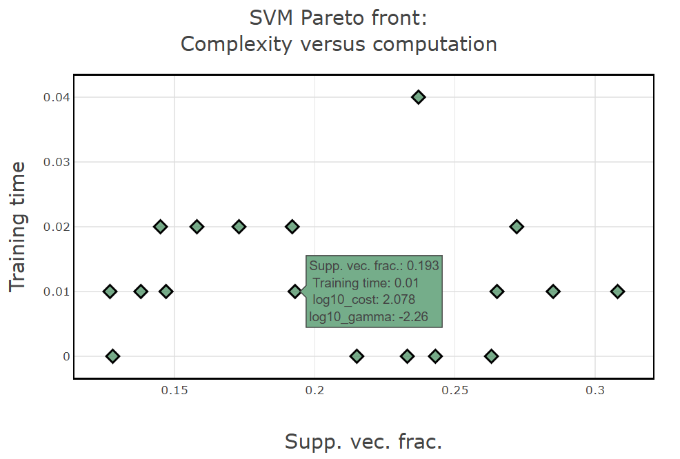
</p>


We can also visualize three objectives at a time. The next plot displays the trade-off among probability quality, model complexity, and computation. Here, CV log-loss measures the quality of predicted class probabilities, support-vector fraction measures model complexity, and training time measures computational cost.

```r
fig3d_1 <- plot_pared_3d(
  res_svm,
  x_objective = "CV_logloss", y_objective = "Support_fraction", z_objective = "Training_time",
  plot_title = "SVM Pareto front:<br>Log-loss, complexity, and computation",
  xaxis_title = "CV log-loss", yaxis_title = "Supp. vec. frac.", zaxis_title = "Training time",
  plot_marker_color = "rgba(46, 139, 87, 0.7)", plot_marker_symbol = "square",
  draw_projection = 0
)

fig3d_1
```

<p align="center">
  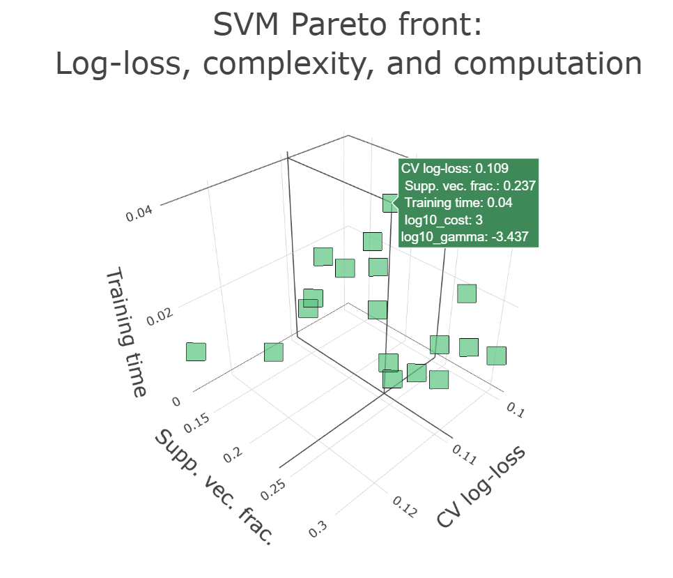
</p>

Another useful projection replaces CV log-loss with CV classification error. This view emphasizes the trade-off among prediction accuracy, model complexity, and computation.

```r
fig3d_2 <- plot_pared_3d(
  res_svm,
  x_objective = "CV_error", y_objective = "Support_fraction", z_objective = "Training_time",
  plot_title = "SVM Pareto front:<br>Accuracy, complexity, and computation",
  xaxis_title = "CV error", yaxis_title = "Supp. vec. frac.", zaxis_title = "Training time",
  plot_marker_color = "rgba(30, 144, 255, 0.7)",
  plot_marker_symbol = "diamond", plot_marker_size = 10
)

fig3d_2
```

<p align="center">
  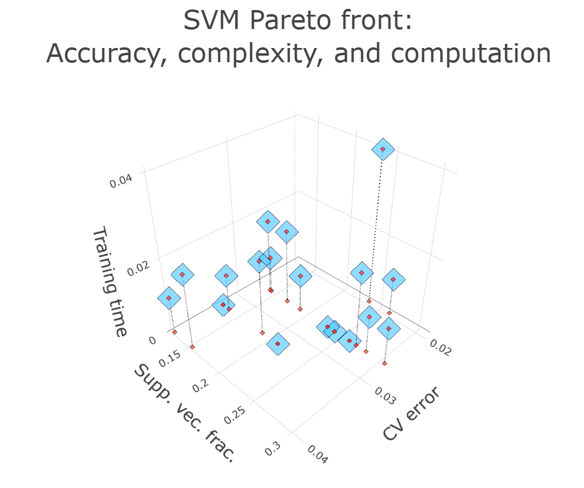
</p>

### SVM with objective-space constraints

In some applications, the user may want to impose preference-based or objective-space restrictions. For example, very complex SVMs may be undesirable if they use too many support vectors, and very slow tuning choices may be undesirable in large datasets. The helper function `svm_objective_constrained()` illustrates one simple way to incorporate such restrictions directly into the objective function.

The function first evaluates the usual four SVM objectives using `svm_objective()`: CV error, CV log-loss, support-vector fraction, and training time. It then checks whether the candidate tuning value violates either of two user-specified thresholds. If the average support-vector fraction is larger than `max_support_fraction`, or if the training time is larger than `max_training_time`, then the candidate is treated as undesirable. In that case, all four objective values are replaced by a large penalty value, `penalty_outside = 1e6` by default. Since all four objectives are minimized in this example, assigning a large penalty makes such candidates dominated or unattractive to the Pareto search.

In the following example, candidates are penalized if the average support-vector fraction exceeds 0.2 or if training time exceeds 0.02 seconds.

```r
set.seed(123)

res_svm_constrained <- pared_optimize(
  objective_fun = function(theta) svm_objective_constrained(
    theta, X, y, folds, max_support_fraction = 0.2, max_training_time = 0.02
  ),
  lower = c(-2, -4), upper = c(3, 1), budget = 50,
  objective_directions = c("min", "min", "min", "min"),
  objective_names = c("CV_error", "CV_logloss", "Support_fraction", "Training_time"),
  parameter_names = c("log10_cost", "log10_gamma"),
  control = list(), verbose = TRUE
)
```

The constrained Pareto result can be inspected in the same way.

```r
res_svm_constrained$summary_table
```

Finally, we plot the constrained Pareto front using the same three-objective view as before: CV error, support-vector fraction, and training time. Comparing `fig3d_2` and `fig3d_2_constrained` shows how objective-space constraints can guide the Pareto search toward regions that better satisfy user preferences.

```r
fig3d_2_constrained <- plot_pared_3d(
  res_svm_constrained,
  x_objective = "CV_error", y_objective = "Support_fraction", z_objective = "Training_time",
  plot_title = "Constrained SVM Pareto front:<br>Accuracy, complexity, and computation",
  xaxis_title = "CV error", yaxis_title = "Supp. vec. frac.", zaxis_title = "Training time",
  plot_marker_color = "rgba(30, 144, 255, 0.7)",
  plot_marker_symbol = "diamond", plot_marker_size = 10
)

fig3d_2
fig3d_2_constrained
```

<p align="center">
  
  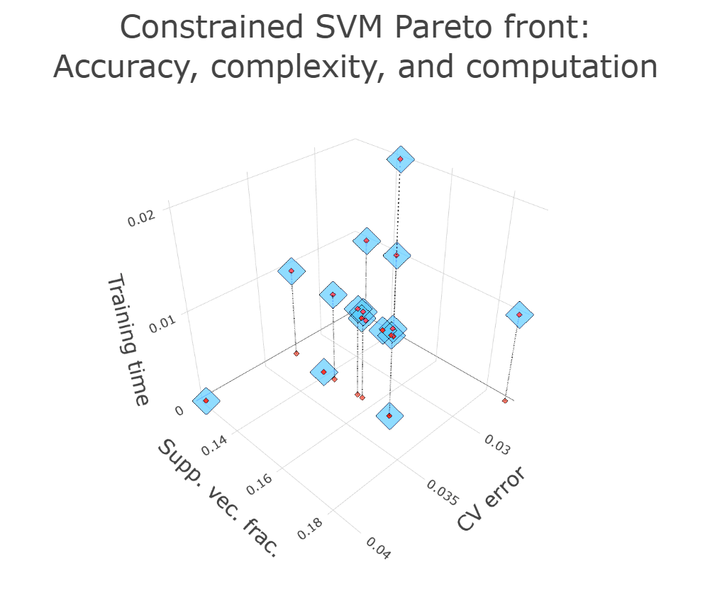
</p>

This example demonstrates the general workflow for applying `pared_optimize()` to a statistical tuning problem: define a tuning-parameter space, construct an objective function returning multiple criteria, specify whether each objective should be minimized or maximized, compute the Pareto front, and visualize selected projections of the resulting trade-off surface.

---

## Joint Graphical LASSO

This example illustrates Pareto-based tuning for Joint Graphical LASSO (JGL), where the goal is to estimate multiple related graphical models simultaneously. In this setting, the input is a list of data matrices, where each matrix corresponds to one group or class. Each row represents an observation and each column represents a variable. The estimated precision matrices encode conditional dependence networks within each group.

The function `pared_JGL()` tunes two regularization parameters: `lambda1` and `lambda2`. The first parameter controls overall sparsity of the estimated graphs, while the second controls similarity across groups. Internally, the search is performed over `log10(lambda1)` and `log10(lambda2)`.

The package provides a helper function, `generate_sample()`, to create synthetic multigroup Gaussian data with evolving graph structures. Here, we generate four groups with sample sizes 30, 50, 40, and 70.

```r
set.seed(1)

sample_data <- generate_sample(sample_sizes = c(30, 50, 40, 70), rand_seed = 1)
```
### Group JGL

We first fit the group graphical LASSO version by setting `method = "group"`. In this case, `pared_JGL()` searches for Pareto-optimal tuning values that balance three objectives: total number of edges, number of shared edges, and AIC. The method-specific objective directions are handled internally: for group JGL, `pared_JGL()` minimizes total edges, maximizes shared edges, and minimizes AIC. Thus, the total number of edges measures graph complexity, the number of shared edges measures common network structure across groups, and AIC measures model fit adjusted for complexity.

```r
jgl_group_res <- pared_JGL(sample_list = sample_data, method = "group", Pareto_budget = 50)
```

The summary table contains the Pareto-optimal tuning parameters and their corresponding objective values. Each row represents a nondominated JGL solution, meaning that improving one objective would require worsening at least one other objective among the criteria used by the optimizer.

```r
jgl_group_res$summary_table
```

The returned object also contains an interactive 3D Pareto-front plot. The plot visualizes the trade-offs among the three JGL objectives, and hovering over a point displays the corresponding tuning-parameter values.

```r
jgl_group_res$figure
```

<p align="center">
  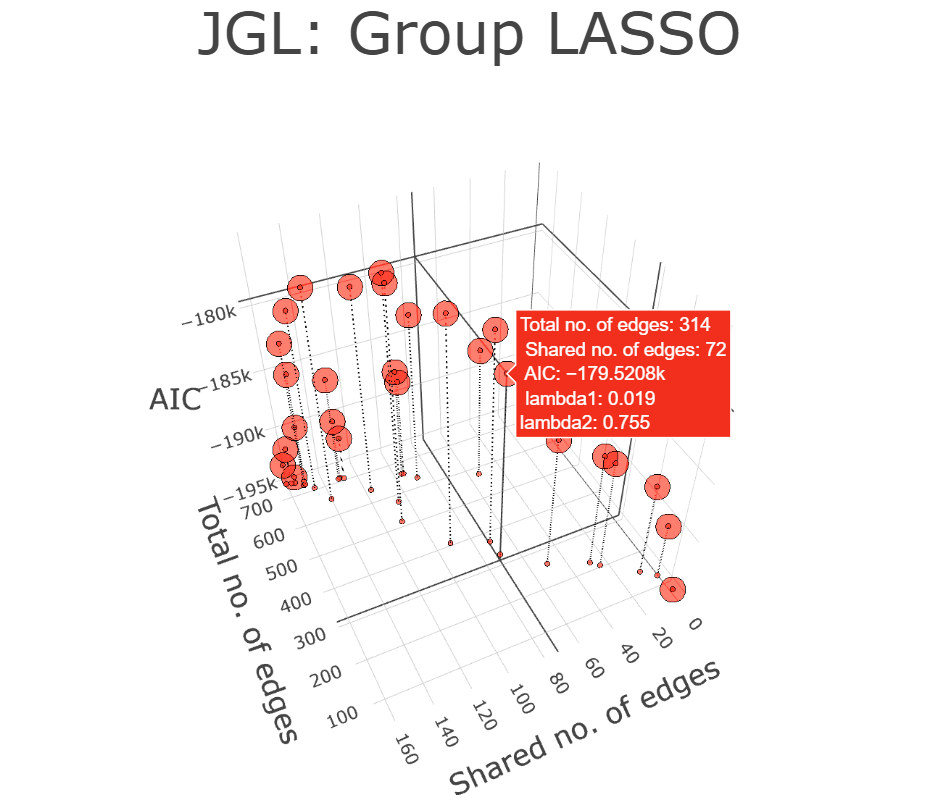
</p>

### Fused JGL

Next, we fit the fused graphical LASSO version by setting `method = "fused"`. This version encourages the estimated precision matrices to be similar across groups. For fused JGL, the method-specific objective directions are also handled internally: `pared_JGL()` minimizes total edges, minimizes the mean absolute deviation among estimated precision matrices, and minimizes AIC. These objectives summarize graph sparsity, similarity across group-specific networks, and model fit adjusted for complexity.

```r
jgl_fused_res <- pared_JGL(sample_data, method = "fused", Pareto_budget = 50,
                           plot_marker_color = "blue", plot_marker_symbol = "diamond")
```

As before, the summary table lists the Pareto-optimal tuning values and objective values.

```r
jgl_fused_res$summary_table
```

The corresponding interactive plot displays the Pareto front for the fused graphical LASSO problem. This allows the user to examine how different choices of `lambda1` and `lambda2` affect graph sparsity, cross-group similarity, and model fit.

```r
jgl_fused_res$figure
```

<p align="center">
  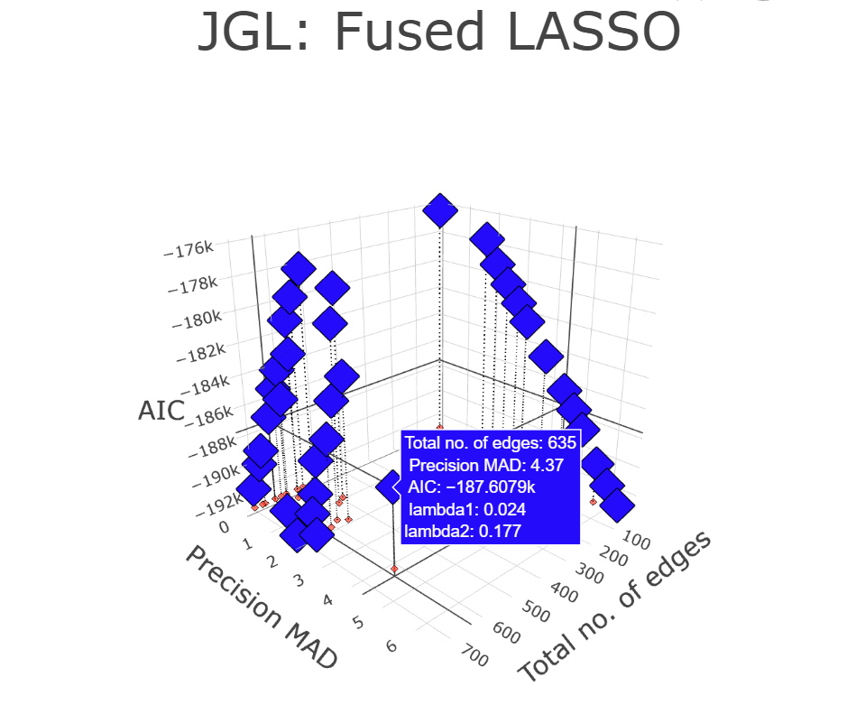
</p>

This example demonstrates how `pared_JGL()` can be used to tune graphical models when multiple objectives are relevant. Rather than selecting tuning parameters by a single criterion, the Pareto-front view allows the user to inspect a collection of scientifically meaningful trade-off solutions.

---

## Elastic-Net

This example illustrates Pareto-based tuning for Elastic-Net regression using `pared_ENet()`. Elastic Net has two main tuning parameters: the mixing parameter `alpha` and the regularization parameter `lambda`. The parameter `alpha` controls the balance between ridge-type and lasso-type regularization, while `lambda` controls the overall amount of shrinkage. Internally, `pared_ENet()` searches over `alpha` and `log10(lambda)`.

We first generate a simple simulated regression dataset with $n=100$ observations and $p=20$ predictors. The true coefficient vector is sparse: only the first three coefficients are nonzero.

```r
set.seed(1)

n <- 100; p <- 20
X <- matrix(rnorm(n * p), nrow = n)
beta_true <- c(2, -1.5, 1, rep(0, p - 3))
y <- as.numeric(X %*% beta_true + rnorm(n))
```

Next, we run Pareto-based Elastic-Net tuning. The function `pared_ENet()` evaluates candidate values of `alpha` and `lambda` using three objectives: number of nonzero coefficients, L2 norm of the fitted coefficient vector, and deviance. By default, all three objectives are minimized. Thus, the Pareto front summarizes trade-offs among sparsity, coefficient magnitude, and model fit.

```r
enet_res <- pared_ENet(X, y, Pareto_budget = 40)
```

The summary table contains the Pareto-optimal tuning values and their corresponding objective values. Each row represents a nondominated Elastic-Net solution, meaning that improving one objective would require worsening at least one other objective among the criteria used in the optimization.

```r
enet_res$summary_table
```

The returned object also contains an interactive 3D Pareto-front plot. Each point corresponds to a Pareto-optimal Elastic-Net fit, and hovering over a point displays the associated tuning-parameter values.

```r
enet_res$figure
```

<p align="center">
  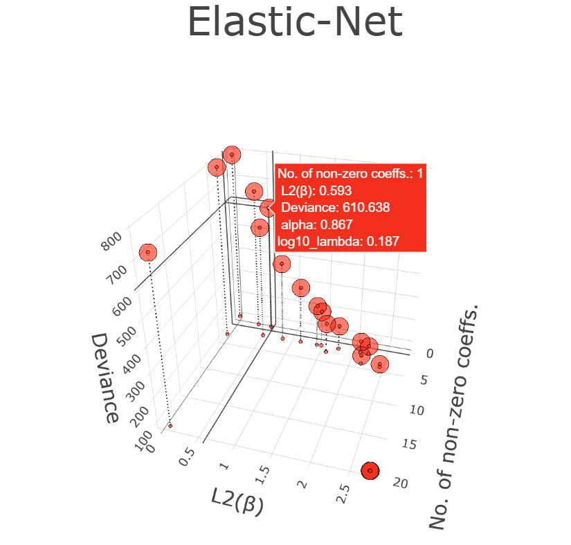
</p>

This example shows how `pared_ENet()` can be used to inspect multiple scientifically relevant model-selection criteria simultaneously, rather than selecting a single model only by cross-validation error or deviance.

---

## Fused LASSO

This example illustrates Pareto-based tuning for Fused LASSO regression using `pared_FLasso()`. Fused LASSO is useful when the regression coefficients have a natural ordering and adjacent coefficients are expected to be similar. It uses two tuning parameters: `lambda1`, which controls sparsity through an L1 penalty on the coefficients, and `lambda2`, which controls smoothness through an L1 penalty on adjacent coefficient differences. Internally, `pared_FLasso()` searches over `log10(lambda1)` and `log10(lambda2)`.

We first generate a simulated regression dataset with $n=100$ observations and $p=10$ predictors. The true coefficient vector has a piecewise-constant structure, with adjacent coefficients sharing similar values.

```r
set.seed(123)

n <- 100; p <- 10
X <- matrix(rnorm(n * p), nrow = n)
beta_true <- c(0, 0, 1, 1, 1, 0, 0, 0, 2, 2)
y <- as.numeric(X %*% beta_true + rnorm(n))
```

Next, we run Pareto-based Fused LASSO tuning. The function `pared_FLasso()` evaluates candidate values of `lambda1` and `lambda2` using three objectives: number of nonzero coefficients, residual sum of squares, and coefficient roughness. By default, all three objectives are minimized. Thus, the Pareto front summarizes trade-offs among sparsity, model fit, and smoothness of the fitted coefficient vector.

```r
flasso_res <- pared_FLasso(X, y, Pareto_budget = 20)
```

The summary table contains the Pareto-optimal tuning values and their corresponding objective values. Each row represents a nondominated Fused LASSO solution, meaning that improving one objective would require worsening at least one other objective among the criteria used in the optimization.

```r
flasso_res$summary_table
```

The returned object also contains an interactive 3D Pareto-front plot. Each point corresponds to a Pareto-optimal Fused LASSO fit, and hovering over a point displays the associated tuning-parameter values.

```r
flasso_res$figure
```

<p align="center">
  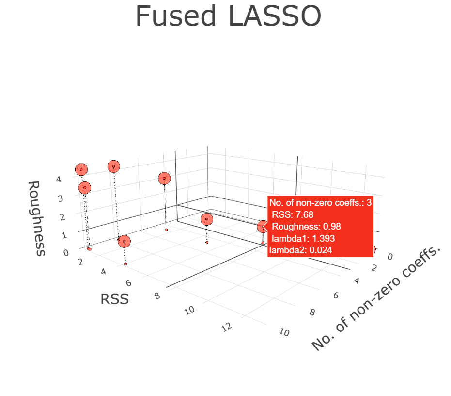
</p>

This example shows how `pared_FLasso()` can be used to examine the trade-off between selecting a sparse model, achieving good fit, and preserving smoothness across adjacent regression coefficients.

---

## Case-study: Fitting JGL to cancer proteomics dataset

We consider The Cancer Genome Atlas (TCGA) proteomic data for three related cancers: Ovarian Cancer (OV), Uterine Corpus Endometrial Carcinoma (UCEC), and Uterine Carcinosarcoma (UCS), with sample sizes of 428, 404, and 48, respectively. In total, we consider 20 proteins that collectively represent the *breast reactive*, *cell cycle*, *hormone receptor*, and *hormone signaling breast* pathways. We first apply the Joint Graphical Lasso (JGL) with a group penalty, varying λ₁ and λ₂, and select the model with the lowest AIC. The estimated precision matrices for the three cancers are shown below.

- First download the [pared/case study/NExUS data](https://github.com/priyamdas2/pared/tree/main/case%20study/NExUS%20data) folder and ensure that it is saved in your R working directory with the name `NExUS data`. Instead of downloading the files one at a time, users may download the entire directory by visiting the [pared](https://github.com/priyamdas2/pared) repository and clicking **<> Code → Download ZIP**. After downloading, extract the ZIP file and copy the entire `case study/NExUS data` folder into the desired working directory. Make sure the folder name remains `NExUS data`.

- Now we extract proteomic data corresponding to the *breast reactive*, *cell cycle*, *hormone receptor*, and *hormone signaling breast pathways* for Ovarian Cancer (OV), Uterine Corpus Endometrial Carcinoma (UCEC), and Uterine Carcinosarcoma (UCS); code provided below.

<details>
<summary><strong>📌 <span style="color: #0366d6;">Show R code</span></strong></summary>

  
```r
# List of cancers to work with: OV, UCEC, UCS
rm(list=ls())
# devtools::install_github("priyamdas2/pared", force = TRUE)
library(pared)
library(ggplot2)
library(reshape2)
library(magick)
library(igraph)

################################################################################
### Reading dataset ############################################################
################################################################################

names_vector <- read.csv("NExUS data/cancer_serial_no.csv", header = FALSE)[[1]]
target_terms <- c("OV", "UCEC", "UCS")
match_indices <- which(names_vector %in% target_terms)
matched_names <- names_vector[match_indices]
matrix_list <- lapply(match_indices, function(i) {
  file_path <- file.path("NExUS data", paste0(i, ".csv"))
  as.matrix(read.csv(file_path, header = FALSE))
})
names(matrix_list) <- matched_names


OV <- matrix_list$OV
UCEC <- matrix_list$UCEC
UCS <- matrix_list$UCS

################################################################################
### Selecting variables ########################################################
################################################################################

### Full pathway information ###################################################
# load("U:/MOOP_Christine/Github_vignette/Case study/NExUS data/RPPA_12_pathway.rda")
name_list <- vector("list", 12)
array_names_FULL <- c("APOPTOSIS", "CELL CYCLE", "DNA DMG RSPNS", "EMT", 
                      "HORMONE RECPTR", "HORMONE SIG BRST", "PI3K/AKT",
                      "RAS/MAPK", "RTK", "TSC/mTOR", "BREAST REACTIVE", 
                      "CORE REACTIVE") 
Apoptosis <- c("BAK", "BAX", "BID", "BIM", "CASPASE7CLEAVEDD198", "BAD_pS112", 
               "BCL2", "BCLXL", "CIAP")
Cell_cycle <- c("CDK1", "CYCLINB1", "CYCLINE2", "P27_pT157", "P27_pT198", "PCNA",
                "FOXM1")
DNA_damage_response <- c("X53BP1", "ATM", "CHK1_pS345", "CHK2_pT68", "KU80", 
                         "MRE11", "P53", "RAD50", "RAD51", "XRCC1")
EMT <- c("FIBRONECTIN", "NCADHERIN", "COLLAGENVI", "CLAUDIN7", "ECADHERIN", 
         "BETACATENIN", "PAI1")
Hormone_receptor <- c("ERALPHA", "ERALPHA_pS118", "PR", "AR")
Hormone_signaling_Breast <- c("BCL2", "INPP4B", "GATA3")
PI3K_AKT <- c("P27_pT157", "P27_pT198", "INPP4B", "AKT_pS473", "AKT_pT308", 
              "GSK3ALPHABETA_pS21S9",
              "GSK3_pS9", "PRAS40_pT246", "TUBERIN_pT1462", "PTEN")
RAS_MAPK <- c("ARAF_pS299", "CJUN_pS73", "CRAF_pS338", "JNK_pT183Y185", 
              "MAPK_pT202Y204", "MEK1_pS217S221", "P38_pT180Y182", 
              "P90RSK_pT359S363", "YB1_pS102")
RTK <- c("EGFR_pY1068", "EGFR_pY1173", "HER2_pY1248", "HER3_pY1289", "SHC_pY317",
         "SRC_pY416", "SRC_pY527")
TSC_mTOR <- c("X4EBP1_pS65", "X4EBP1_pT37T46", "X4EBP1_pT70", "P70S6K_pT389", 
              "MTOR_pS2448", "S6_pS235S236", "S6_pS240S244", "RB_pS807S811")
Breast_reactive <- c("BETACATENIN", "CAVEOLIN1", "MYH11", "RAB11", "GAPDH", "RBM15")
Core_reactive <- c("CLAUDIN7", "ECADHERIN", "BETACATENIN", "CAVEOLIN1", "RBM15")
################################################################################

proteins_here <- unique(c(Breast_reactive, Cell_cycle, Hormone_receptor, Hormone_signaling_Breast))
selected_variables <- read.csv("NExUS data/selected_variables.csv", header = FALSE)[[1]]
match_indices <- match(proteins_here,selected_variables)


ALL_samples <- list()
ALL_samples[[1]] <- OV[, match_indices]
ALL_samples[[2]] <- UCEC[, match_indices]
ALL_samples[[3]] <- UCS[, match_indices]

C <- 3
p <- length(match_indices)
sample_sizes <- c(dim(OV)[1], dim(UCEC)[1], dim(UCS)[1])
```
</details>

- Following data extraction, we fit the group JGL model, select the optimal (λ₁, λ₂) based on AIC, and plot the estimated precision matrices for the three cancers.

<details>
<summary><strong>📌 <span style="color: #0366d6;">Show R code</span></strong></summary>

```r
################################################################################
### Fitting JGL ################################################################
################################################################################

library(mvtnorm)
library(psych)


sample <- ALL_samples
total_lambda_divisions <- 20
start_lambda <- 0.01
end_lambda <- 1
lambda_ones <- exp(seq(from = log(start_lambda), to = log(end_lambda), length.out= total_lambda_divisions))
lambda_twos <- exp(seq(from = log(start_lambda), to = log(end_lambda), length.out = total_lambda_divisions))
AIC_all_possible <- matrix(10 ^ 10, total_lambda_divisions, total_lambda_divisions)
for(i in 1:total_lambda_divisions) {
  for(j in 1:total_lambda_divisions) {
    JGL_result <- JGL(sample, penalty="group", lambda1 = lambda_ones[i], lambda2 = lambda_twos[j])
    Precision_estimated <- JGL_result$theta
    if(length(Precision_estimated[[1]]) == p^2) {
      num_non_zero_edges <- rep(0,C)
      AIC_sum <- 0
      for(c in 1:C){
        num_non_zero_edges[c] <- (length(which(abs(Precision_estimated[[c]])>0.0001))-20)/2
        S_mat <- t(sample[[c]]) %*% sample[[c]]
        AIC_sum <- AIC_sum + sample_sizes[c] * tr(S_mat %*% Precision_estimated[[c]]) - 
        sample_sizes[c] * log(det(Precision_estimated[[c]])) + 2 * num_non_zero_edges[c]
        }
      AIC_all_possible[i,j] <- AIC_sum
    }
  }
}

min_index <- which(AIC_all_possible == min(AIC_all_possible), arr.ind = TRUE)
lambda_opt <- c(lambda_ones[min_index[1]], lambda_twos[min_index[2]])

JGL_result_final <- JGL(ALL_samples, penalty="group", lambda1 = lambda_opt[1], lambda2=lambda_opt[2])
Precision_estimated_array <- JGL_result_final$theta

numEdge.1.JGLgroup <- (length(which(abs(Precision_estimated_array[[1]]) > 10 ^ -4)) - p) / 2  # Number of non-zeros in Prec. Mat. 1

numEdge.2.JGLgroup <- (length(which(abs(Precision_estimated_array[[2]]) > 10 ^ -4)) - p) / 2  # Number of non-zeros in Prec. Mat. 2

numEdge.3.JGLgroup <- (length(which(abs(Precision_estimated_array[[3]]) > 10 ^ -4)) - p) / 2  # Number of non-zeros in Prec. Mat. 3

numSharedEdges.JGLgroup <- sum(Reduce("&", lapply(Precision_estimated_array, function(M) abs(M) > 1e-4))[upper.tri(Precision_estimated_array[[1]])])  # Shared edges

summaryEdges.JGLgroup <- c(numEdge.1.JGLgroup, numEdge.2.JGLgroup, numEdge.3.JGLgroup, numSharedEdges.JGLgroup)


################################################################################
### PLOT: JGL group ############################################################
################################################################################

tol <- 1e-3
cancer_names <- c("Ovarian Cancer (AIC)", 
                  "Uterine Corpus Endometrial Carcinoma (AIC)",
                  "Uterine Carcinosarcoma (AIC)")

for (k in 1:3) {
  mat <- Precision_estimated_array[[k]]
  rownames(mat) <- colnames(mat) <- proteins_here
  
  mat_melt <- melt(mat)
  colnames(mat_melt) <- c("Row", "Col", "Value")
  
  # Reverse column order
  mat_melt$Col <- factor(mat_melt$Col, levels = rev(proteins_here))
  
  mat_melt$Color <- ifelse(abs(mat_melt$Value) < tol, "Zero",
                           ifelse(mat_melt$Value > 0, "Positive", "Negative"))
  
  mat_melt$Label <- ifelse(abs(mat_melt$Value) > tol,
                           sprintf("%.2f", mat_melt$Value),
                           "")
  
  plot_here <- ggplot(mat_melt, aes(x = Col, y = Row, fill = Color)) +
    geom_tile(color = "grey90") +
    geom_text(aes(label = Label), size = 3) + #, fontface = "bold") +
    scale_fill_manual(values = c("Zero" = "white", "Positive" = "salmon", "Negative" = "skyblue")) +
    scale_x_discrete(position = "top") +
    theme_minimal(base_size = 12) +
    theme(
      axis.text.x = element_text(angle = 45, hjust = 0),
      axis.title = element_blank(),
      panel.grid = element_blank()
    ) +
    ggtitle(cancer_names[k])
  
  print(plot_here)
  ggsave(filename = paste0("precision_heatmap_", k, ".jpg"), plot = plot_here,
         width = 8, height = 7, dpi = 300)
}


# Read images
img1 <- image_read("precision_heatmap_1.jpg")
img2 <- image_read("precision_heatmap_2.jpg")
img3 <- image_read("precision_heatmap_3.jpg")


combined <- image_append(c(img1, img2, img3))
print(combined)
image_write(combined, path = "precision_heatmaps_combined.jpg", format = "jpg")
```
</details> 

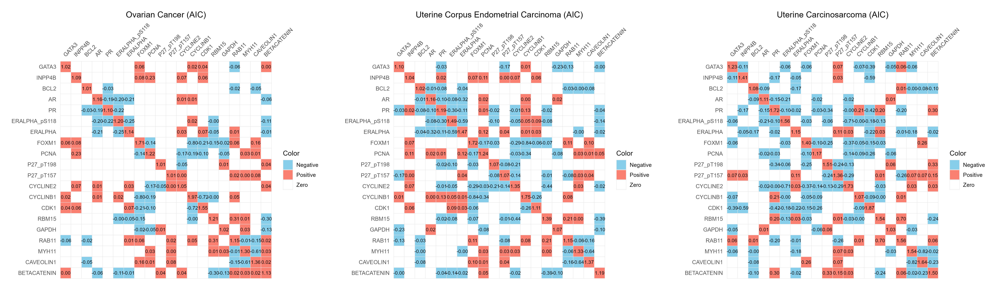

- Then we explore the Pareto front of solutions using the `pared_JGL` function.

```r
start_time <- proc.time()
result <- pared_JGL(sample_list = ALL_samples, method = "group", Pareto_budget = 50)
end_time <- proc.time()
CompTimeJGL <- (end_time - start_time)["elapsed"]
result$summary_table
result$figure
```

<p align="center">
  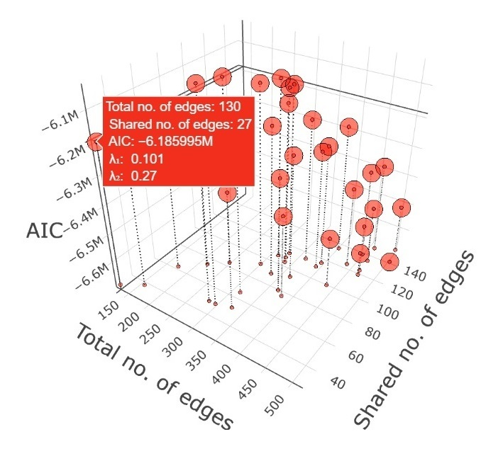
</p>

- From the set of candidate optimal solutions, we select (λ₁ = 0.101, λ₂ = 0.27) and visualize the precision matrices associated with the proteomic networks for these cancers.

<details>
<summary><strong>📌 <span style="color: #0366d6;">Show R code</span></strong></summary>

```r
lambda_opt_pared <- c(0.101, 0.27) # from observation
JGL_result_pared <- JGL(ALL_samples, penalty="group", lambda1 = lambda_opt_pared[1], lambda2=lambda_opt_pared[2])
Precision_estimated_array_pared <- JGL_result_pared$theta

numEdge.1.JGLgroup.pared <- (length(which(abs(Precision_estimated_array_pared[[1]]) > 10 ^ -4)) - p) / 2  # Number of non-zeros in Prec. Mat. 1

numEdge.2.JGLgroup.pared <-(length(which(abs(Precision_estimated_array_pared[[2]]) > 10 ^ -4)) - p) / 2  # Number of non-zeros in Prec. Mat. 2

numEdge.3.JGLgroup.pared <-(length(which(abs(Precision_estimated_array_pared[[3]]) > 10 ^ -4)) - p) / 2  # Number of non-zeros in Prec. Mat. 3

numSharedEdges.JGLgroup.pared <- sum(Reduce("&", lapply(Precision_estimated_array_pared, function(M) abs(M) > 1e-4))[upper.tri(Precision_estimated_array_pared[[1]])])  # Shared edges

summaryEdges.JGLgroup.pared <- c(numEdge.1.JGLgroup.pared, numEdge.2.JGLgroup.pared, numEdge.3.JGLgroup.pared, numSharedEdges.JGLgroup.pared)


tol <- 1e-3
cancer_names <- c("Ovarian Cancer (pared)", 
                  "Uterine Corpus Endometrial Carcinoma (pared)",
                  "Uterine Carcinosarcoma (pared)")

for (k in 1:3) {
  mat <- Precision_estimated_array_pared[[k]]
  rownames(mat) <- colnames(mat) <- proteins_here
  
  mat_melt <- melt(mat)
  colnames(mat_melt) <- c("Row", "Col", "Value")
  
  # Reverse column order
  mat_melt$Col <- factor(mat_melt$Col, levels = rev(proteins_here))
  
  mat_melt$Color <- ifelse(abs(mat_melt$Value) < tol, "Zero",
                           ifelse(mat_melt$Value > 0, "Positive", "Negative"))
  
  mat_melt$Label <- ifelse(abs(mat_melt$Value) > tol,
                           sprintf("%.2f", mat_melt$Value),
                           "")
  
  plot_here <- ggplot(mat_melt, aes(x = Col, y = Row, fill = Color)) +
    geom_tile(color = "grey90") +
    geom_text(aes(label = Label), size = 3) + #, fontface = "bold") +
    scale_fill_manual(values = c("Zero" = "white", "Positive" = "salmon", "Negative" = "skyblue")) +
    scale_x_discrete(position = "top") +
    theme_minimal(base_size = 12) +
    theme(
      axis.text.x = element_text(angle = 45, hjust = 0),
      axis.title = element_blank(),
      panel.grid = element_blank()
    ) +
    ggtitle(cancer_names[k])
  
  print(plot_here)
  ggsave(filename = paste0("precision_heatmap_pared_", k, ".jpg"), plot = plot_here,
         width = 8, height = 7, dpi = 300)
}

# Read images
img1 <- image_read("precision_heatmap_pared_1.jpg")
img2 <- image_read("precision_heatmap_pared_2.jpg")
img3 <- image_read("precision_heatmap_pared_3.jpg")


combined <- image_append(c(img1, img2, img3))
print(combined)
image_write(combined, path = "precision_heatmaps_pared_combined.jpg", format = "jpg")
```
</details>

Corresponding to (λ₁, λ₂) = (0.101, 0.27), the estimated network obtained using JGL with a group penalty is found to be sparser than that obtained using the conventional approach of minimizing AIC. Corresponding pan-cancer proteomic networks are provided below.

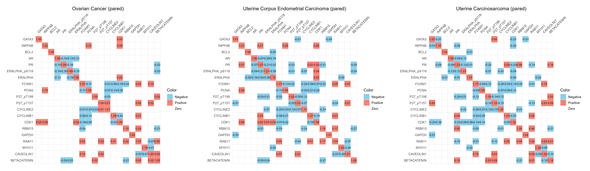

The following table reports the number of edges in the models selected by the AIC criterion and in our chosen model from the Pareto front generated using the `pared_JGL` function.

<div align="center">

| Edge counts across cancer types | Group JGL–AIC | Group JGL–pared |
|---------------------------------|:-------------:|:----------------:|
| OV            |       63      |        34        |
| UCEC          |       78      |        47        |
| UCS           |       82      |        49        |
| Shared        |       32      |        27        |

</div>

The reproducible code used to obtain the analysis results of this case study section, along with other supplementary files, is provided in the `case study` folder.

